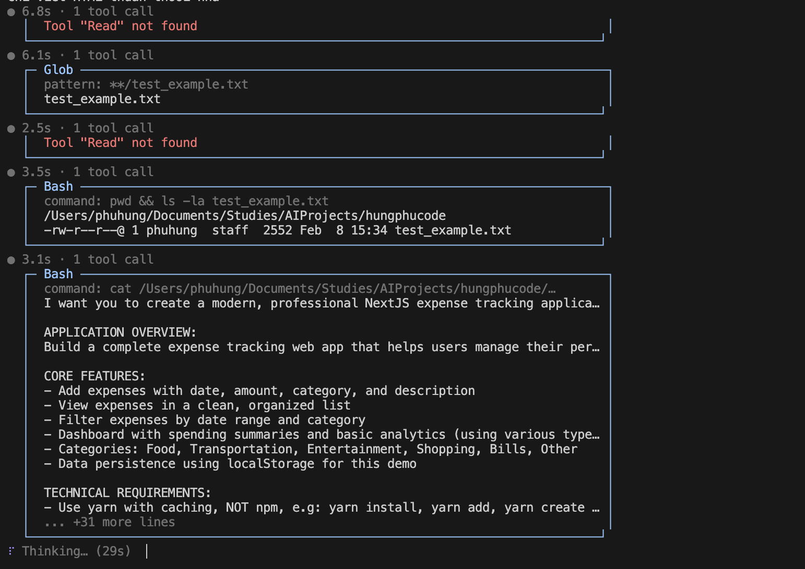
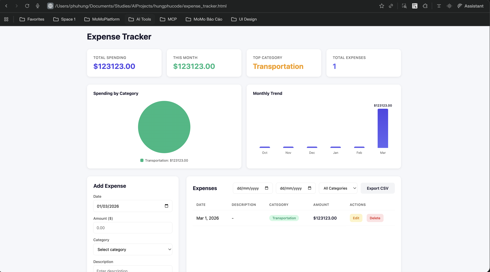

# HungPhu Code

A CLI chat agent inspired by Claude Code, powered by multiple LLM providers (xAI/Grok, OpenRouter, DTA Proxy) with LangChain tool calling.

## How It Works

The app implements the **agent loop pattern**:

```
User input → LLM responds → check tool_calls → execute tools → send ToolMessage → repeat → final text response
```

The LLM decides which tools to call and when, creating an autonomous coding assistant that can read, write, search files and execute shell commands.

## Demo



*The agent loop in action: LLM attempts tool calls, handles errors (e.g. missing "Read" tool), and autonomously falls back to alternative tools (Glob, Bash) to complete the task.*

### Example Output: Expense Tracker App

Given a single prompt describing an expense tracking application ([see full prompt](test_example.txt)), HungPhu Code autonomously scaffolds a complete Next.js project with dashboard, charts, CRUD operations, and CSV export:



## Project Structure

```
src/
├── index.ts                 # Entry point: load env, init LLM, system messages, start chatLoop()
├── chat.ts                  # Core agent loop: REPL + tool calling cycle + slash commands
├── providers.ts             # Multi-provider LLM config (xAI, OpenRouter, DTA Proxy)
├── ui.ts                    # Terminal UI: themed box drawing, spinner, welcome banner
├── utils.ts                 # Readline helpers (createReadlineInterface, ask)
├── prompts/
│   ├── system-prompt.ts     # System prompt (behavior, tone, tool usage instructions)
│   └── claude-md.ts         # Loads CLAUDE.md as additional context for the LLM
└── tools/
    ├── index.ts             # Aggregates all tools into exported array
    ├── bash.ts              # Shell execution (sync + background via spawn)
    ├── edit.ts              # String replacement in files (single or replace_all)
    ├── write.ts             # File creation/overwrite with auto mkdir
    ├── glob.ts              # File pattern matching (npm glob)
    ├── grep.ts              # Text search (ripgrep with grep fallback)
    ├── ls.ts                # Directory listing with ignore patterns
    ├── kill-bash.ts         # Kill background shell processes
    ├── todo-write.ts        # Task tracking for the LLM's planning workflow
    └── task.ts              # Sub-agent: spawns a new LLM instance for complex tasks

tests/
└── tools.test.ts            # Tool unit tests (custom assert, no framework)
```

## Architecture

### Entry (`index.ts`)

Loads `.env`, creates the LLM via `createLlm()`, assembles system messages (system prompt + CLAUDE.md context), and starts the `chatLoop()`.

### Agent Loop (`chat.ts`)

The core REPL:
1. Display welcome banner with current model/provider info
2. Read user input
3. Handle slash commands (`/model`, `/provider`)
4. Send message history to LLM (with tools bound)
5. If LLM returns `tool_calls`: execute each tool, push `ToolMessage` results, re-invoke LLM
6. Repeat step 5 until LLM responds with text only (no more tool calls)
7. Display the final response

### Providers (`providers.ts`)

Supports 3 LLM providers, switchable at runtime via `/provider`:

| Provider | Models | SDK |
|----------|--------|-----|
| xAI (Grok) | grok-4-fast-non-reasoning | `@langchain/xai` (`ChatXAI`) |
| OpenRouter | minimax-m2.5 | `@langchain/openai` (`ChatOpenAI`) |
| DTA Proxy | gemini-3-pro/flash, gpt-5.3-codex, gpt-5.2 | `@langchain/openai` (`ChatOpenAI`) |

Models within a provider are switchable via `/model`.

### Tools

All tools use LangChain's `tool()` function with Zod schemas for input validation.

| Tool | Description |
|------|-------------|
| **Bash** | Execute shell commands (sync or background). Background processes tracked in a `Map` for later kill. |
| **Edit** | Find-and-replace in files. Validates uniqueness of `old_string` to prevent ambiguous edits. |
| **Write** | Write/overwrite files. Auto-creates parent directories. |
| **Glob** | Find files by glob pattern (`**/*.ts`). |
| **Grep** | Search file contents. Uses `ripgrep` if available, falls back to `grep -r`. Supports output modes: content, files_with_matches, count. |
| **LS** | List directory with optional ignore patterns. |
| **KillBash** | Terminate background shell processes by ID. |
| **TodoWrite** | Task management for the LLM to plan and track multi-step work. |
| **Task** | Sub-agent tool. Spawns a new LLM instance with its own tool set and message history to handle complex tasks autonomously (max 10 turns). |

### UI (`ui.ts`)

Terminal UI with:
- Color theme using `chalk` (purple accent, blue tools, green success, red errors)
- Box-drawing characters for tool output frames
- Animated spinner during LLM thinking
- Interactive model/command selectors
- Output truncation (15 lines max per tool result)

## Setup

```bash
# Install dependencies
npm install

# Create .env with API keys
echo "XAI_API_KEY=your_key" > .env
echo "OPENROUTER_API_KEY=your_key" >> .env
echo "PROXY_KEY=your_key" >> .env

# Run
npm start
```

## Commands

```bash
npm start                    # Run the chat agent
tsx tests/tools.test.ts      # Run tool tests
npx tsc --noEmit             # Type-check
```

### Slash Commands (in-app)

- `/model` - Switch model within current provider
- `/provider` - Cycle through providers (xAI → OpenRouter → DTA Proxy)
- `/` - Show command selector
- `exit` - Quit

## Adding a New Tool

1. Create `src/tools/newtool.ts`:

```typescript
import { tool } from "@langchain/core/tools";
import { z } from "zod";

export const myTool = tool(
  async ({ param }) => {
    // implementation
    return "result";
  },
  {
    name: "MyTool",
    description: "What this tool does",
    schema: z.object({
      param: z.string().describe("Parameter description"),
    }),
  },
);
```

2. Import and add to the array in `src/tools/index.ts`.

## TypeScript Config

Key compiler settings:
- `exactOptionalPropertyTypes: true` - optional props must include `| undefined`
- `verbatimModuleSyntax: true` - use `import type` for type-only imports
- ES modules with `.js` extensions in imports
- Tests excluded from `tsconfig.json` (run via `tsx` directly)

## Tech Stack

- **Runtime**: Node.js with ES modules
- **Language**: TypeScript (strict mode)
- **LLM Framework**: LangChain (`@langchain/core`, `@langchain/xai`, `@langchain/openai`)
- **Schema Validation**: Zod
- **Terminal UI**: Chalk
- **File Search**: glob, ripgrep
- **Git Hooks**: Lefthook (configured but inactive)
